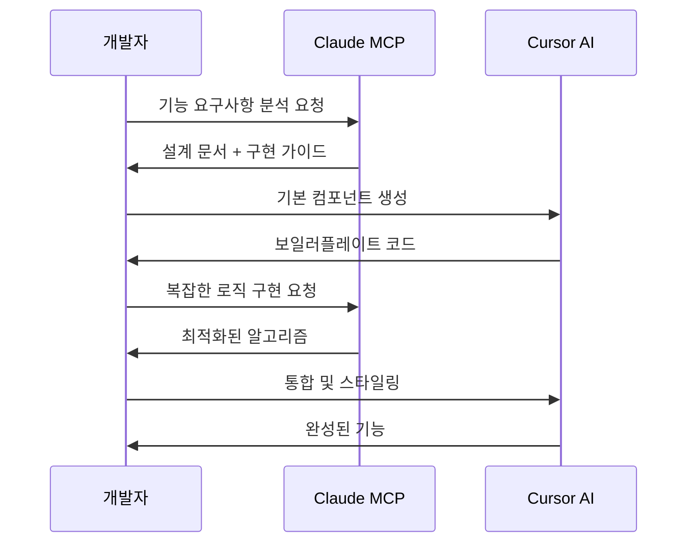
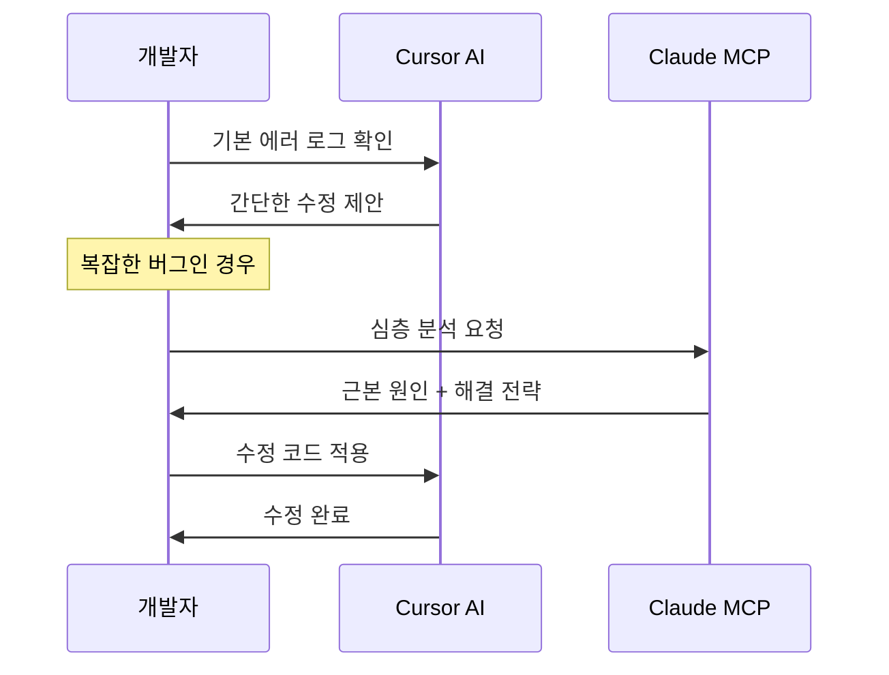
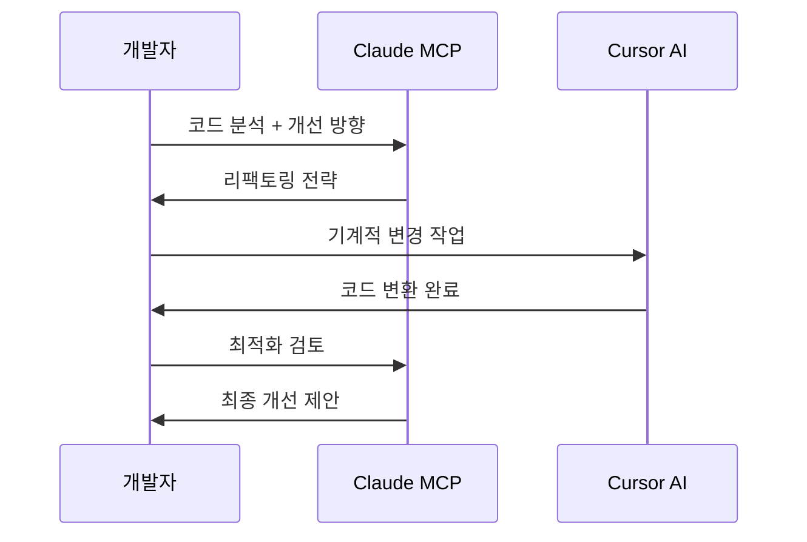

# AI 개발 역할 분담 가이드

> Claude MCP + Cursor AI를 활용한 효율적인 개발 워크플로우

## 🎯 기본 원칙

### Claude MCP의 강점
- **고도의 추상적 사고** - 아키텍처 설계, 복잡한 로직 구현
- **문제 해결 능력** - 디버깅, 최적화, 코드 분석
- **맥락적 이해** - 프로젝트 전체 구조 파악 및 설계

### Cursor AI의 강점
- **빠른 코드 생성** - 보일러플레이트, 반복 작업
- **실시간 완성** - 타이핑과 동시에 코드 제안
- **로컬 컨텍스트** - 현재 파일 기반 빠른 수정

---

## 📋 역할 분담표

| 작업 유형 | Claude MCP | Cursor AI | 우선순위 |
|-----------|------------|-----------|----------|
| **프로젝트 기획** | ✅ 주도 | ❌ | High |
| **아키텍처 설계** | ✅ 주도 | ❌ | High |
| **복잡한 알고리즘** | ✅ 주도 | 🔄 보조 | High |
| **UI 컴포넌트 생성** | 🔄 가이드 | ✅ 주도 | Medium |
| **스타일링** | ❌ | ✅ 주도 | Low |
| **CRUD 구현** | 🔄 설계 | ✅ 구현 | Medium |
| **설정 파일** | ❌ | ✅ 주도 | Low |
| **버그 분석** | ✅ 주도 | 🔄 보조 | High |
| **성능 최적화** | ✅ 주도 | 🔄 적용 | High |
| **테스트 코드** | 🔄 전략 | ✅ 구현 | Medium |
| **문서화** | ✅ 주도 | 🔄 보조 | Medium |

**범례:**
- ✅ 주도: 해당 AI가 주도적으로 수행
- 🔄 보조: 다른 AI를 보조하는 역할
- ❌ 미수행: 해당 AI가 수행하지 않음

---

## 🔄 워크플로우 시나리오

### 시나리오 1: 새로운 기능 개발



### 시나리오 2: 버그 수정



### 시나리오 3: 리팩토링



---

## 🎯 구체적 작업 가이드

### Claude MCP 전용 작업

#### 1. 프로젝트 설계
```markdown
프롬프트 예시:
"React TypeScript 프로젝트에서 [기능명]을 구현하기 위한 
아키텍처를 설계해줘. 다음 요구사항을 고려해서:
- 확장성
- 성능
- 유지보수성"
```

#### 2. 복잡한 로직 구현
```markdown
프롬프트 예시:
"다음 비즈니스 로직을 최적화해줘:
[현재 코드]

고려사항:
- 시간복잡도 개선
- 메모리 효율성
- 에러 핸들링"
```

#### 3. 문제 해결
```markdown
프롬프트 예시:
"다음 에러가 발생하는 근본 원인을 분석해줘:
[에러 메시지 + 관련 코드]

프로젝트 컨텍스트:
[프로젝트 구조 설명]"
```

### Cursor AI 전용 작업

#### 1. 컴포넌트 생성
```javascript
// Cursor에게 요청하는 방식
// 파일명: Button.tsx
// 주석으로 요구사항 작성
// Modern React component with TypeScript
// Props: variant, size, onClick, children
// Tailwind styling
```

#### 2. CRUD 구현
```javascript
// 파일명: api/users.ts
// RESTful API routes for user management
// GET, POST, PUT, DELETE
// Error handling
// TypeScript types
```

#### 3. 스타일링
```css
/* 파일명: styles.css */
/* Component styling for modal */
/* Mobile responsive */
/* Dark mode support */
```

---

## 💡 효율적 사용 팁

### Claude 사용량 절약

1. **배치 질문**
   ```markdown
   다음 3가지에 대해 모두 답변해줘:
   1. A 기능 설계
   2. B 컴포넌트 구조
   3. C 최적화 방안
   ```

2. **명확한 컨텍스트**
   ```markdown
   현재 프로젝트 상황:
   - 기술스택: [스택 정보]
   - 현재 구조: [구조 설명]
   - 해결하려는 문제: [구체적 문제]
   
   질문: [구체적 질문]
   ```

3. **재사용 가능한 답변 요청**
   ```markdown
   "앞으로도 비슷한 상황에서 사용할 수 있는 
   일반화된 패턴으로 답변해줘"
   ```

### Cursor 활용 극대화

1. **파일별 명확한 주석**
   ```javascript
   // TODO: Authentication middleware
   // Features: JWT validation, role checking
   // Error: Return 401/403 appropriately
   ```

2. **단계별 구현**
   ```javascript
   // Step 1: Basic structure
   // Step 2: Add validation
   // Step 3: Error handling
   // Step 4: Tests
   ```

---

## 🚦 의사결정 플로우

```
새로운 작업 시작
    ↓
복잡한 설계가 필요한가?
    ↓ Yes → Claude MCP
    ↓ No
기계적 구현 작업인가?
    ↓ Yes → Cursor AI
    ↓ No
문제 해결이 필요한가?
    ↓ Yes → Claude MCP
    ↓ No → 단순 작업이면 Cursor AI
```

---

## 📊 성과 측정

### KPI 지표
- **개발 속도**: 기능 구현 시간
- **코드 품질**: 버그 발생률, 코드 리뷰 점수
- **AI 사용 효율**: Claude 사용량 대비 결과물 품질
- **유지보수성**: 코드 수정 용이성

### 개선 포인트 체크리스트
- [ ] Claude의 설계가 실제 구현으로 잘 연결되는가?
- [ ] Cursor의 구현이 설계 의도를 잘 반영하는가?
- [ ] 전체 워크플로우에서 병목 지점은 없는가?
- [ ] AI별 역할 분담이 명확하게 지켜지는가?

---

*이 문서는 프로젝트 진행에 따라 지속적으로 업데이트됩니다.*
