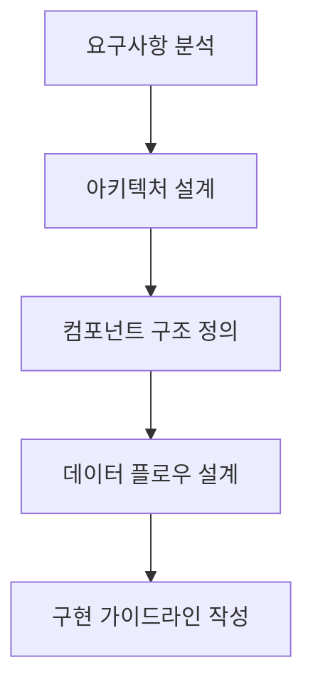
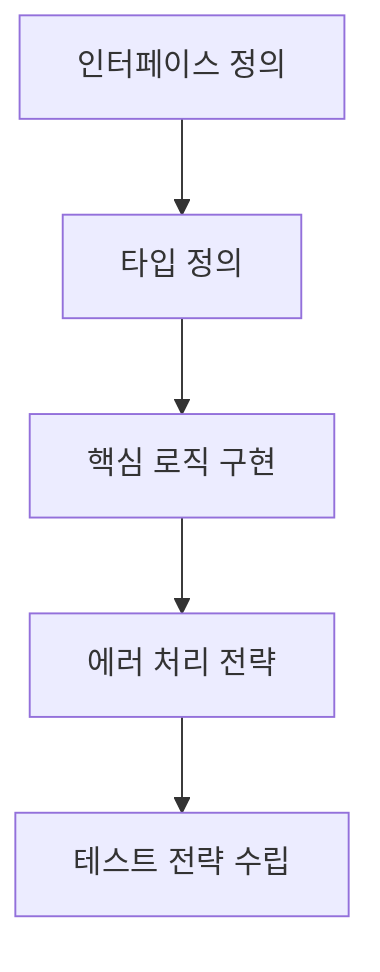
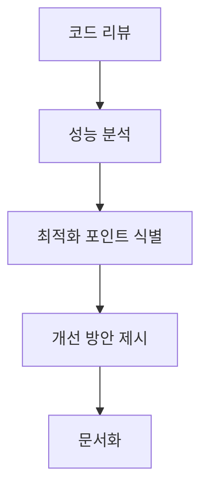

# Claude MCP 전용 가이드

> 고도의 사고력이 필요한 작업을 위한 전용 가이드

## 🎯 Claude의 핵심 역할

### 1. 아키텍처 설계자
- 전체 시스템 구조 설계
- 컴포넌트 간의 관계 정의
- 확장 가능한 구조 제안
- 성능 고려사항 분석

### 2. 복잡한 로직 구현자
- 알고리즘 최적화
- 상태 관리 로직
- 비즈니스 로직 구현
- 에러 처리 전략

### 3. 문제 해결 전문가
- 버그 근본 원인 분석
- 성능 병목 지점 파악
- 코드 품질 개선 제안
- 리팩토링 전략 수립

## 📝 요청 템플릿

### 프로젝트 기획 요청
```markdown
# 프로젝트 기획 요청

## 프로젝트 개요
- **목표**: [구체적인 목표]
- **기술스택**: [사용할 기술들]
- **제약사항**: [시간, 리소스, 기술적 제약]

## 요구사항
1. [기능 요구사항 1]
2. [기능 요구사항 2]
3. [비기능 요구사항들]

## 질문
다음 항목들에 대해 설계해줘:
1. 전체 아키텍처 구조
2. 핵심 컴포넌트 설계
3. 데이터 플로우
4. 확장성 고려사항
```

### 복잡한 로직 구현 요청
```markdown
# 복잡한 로직 구현 요청

## 현재 상황
- **기존 코드**: 
```typescript
[현재 구현된 코드]
```

## 문제점
- [성능 이슈]
- [확장성 문제]
- [유지보수 어려움]

## 개선 목표
- [목표 1: 성능 개선]
- [목표 2: 코드 가독성]
- [목표 3: 확장성]

## 제약사항
- [기존 API 호환성]
- [의존성 제약]
```

### 버그 분석 요청
```markdown
# 버그 분석 요청

## 에러 정보
- **에러 메시지**: [정확한 에러 메시지]
- **발생 시점**: [언제 발생하는지]
- **재현 방법**: [단계별 재현 방법]

## 관련 코드
```typescript
[에러가 발생하는 코드 블록]
```

## 프로젝트 컨텍스트
- **파일 구조**: [관련 파일들의 구조]
- **의존성**: [관련 라이브러리들]
- **환경**: [개발/운영 환경 정보]

## 요청사항
1. 근본 원인 분석
2. 해결 방법 제시
3. 예방 방법 제안
```

## 🔄 작업 플로우

### 1단계: 설계 및 계획


### 2단계: 상세 설계


### 3단계: 검토 및 최적화


## 💡 효과적인 질문 방법

### DO ✅
- **구체적인 컨텍스트 제공**
  ```markdown
  "Next.js 13 App Router를 사용하는 TypeScript 프로젝트에서
  실시간 채팅 기능을 구현하려고 해. WebSocket과 Server-Sent Events 중
  어떤 것이 더 적합한지 장단점을 비교해서 추천해줘."
  ```

- **단계별 요청**
  ```markdown
  "1단계: 전체 아키텍처 설계
   2단계: 핵심 컴포넌트 인터페이스 정의
   3단계: 상태 관리 전략
   각 단계별로 자세히 설명해줘."
  ```

- **제약사항 명시**
  ```markdown
  "제약사항:
   - 기존 API와 호환되어야 함
   - 모바일 성능 고려 필요
   - 번들 크기 최소화 필요"
  ```

### DON'T ❌
- **모호한 요청**
  ```markdown
  "게임 만들고 싶어" ❌
  ```

- **단순 구현 요청**
  ```markdown
  "버튼 컴포넌트 만들어줘" ❌
  → Cursor AI에게 요청
  ```

- **설정 파일 요청**
  ```markdown
  "package.json 만들어줘" ❌
  → Cursor AI에게 요청
  ```

## 🎓 전문성 활용 영역

### 알고리즘 최적화
```typescript
// Before: O(n²) 시간복잡도
function findDuplicates(arr: number[]): number[] {
  const result = [];
  for (let i = 0; i < arr.length; i++) {
    for (let j = i + 1; j < arr.length; j++) {
      if (arr[i] === arr[j] && !result.includes(arr[i])) {
        result.push(arr[i]);
      }
    }
  }
  return result;
}

// Claude에게 최적화 요청
// → O(n) 시간복잡도로 개선된 알고리즘 제공
```

### 아키텍처 패턴 제안
```markdown
요청: "대규모 React 애플리케이션에서 상태 관리를 어떻게 구조화할까?"

Claude 응답:
1. Layered Architecture 제안
2. Domain-Driven Design 적용
3. CQRS 패턴 고려사항
4. 각 패턴의 장단점 분석
```

### 성능 최적화 전략
```markdown
요청: "React 컴포넌트 렌더링 성능이 느려. 최적화 방법은?"

Claude 응답:
1. React.memo() 적용 전략
2. useMemo, useCallback 최적 사용법
3. 컴포넌트 분할 전략
4. 가상화(Virtualization) 적용 고려
```

## 📊 성과 측정

### 설계 품질 지표
- [ ] 확장성: 새로운 기능 추가 용이성
- [ ] 유지보수성: 코드 수정 시 영향 범위
- [ ] 성능: 목표 성능 지표 달성
- [ ] 재사용성: 컴포넌트/함수 재사용 가능성

### 문제 해결 효과성
- [ ] 버그 재발 방지
- [ ] 근본 원인 해결
- [ ] 예방 조치 수립
- [ ] 팀 학습 효과

## 🔄 Cursor AI와의 협업 포인트

### Claude → Cursor 인계 시점
1. **설계 완료 후**
   ```markdown
   "다음 설계를 바탕으로 Cursor에게 구현을 요청해:
   [상세한 설계 문서]"
   ```

2. **복잡한 로직 완성 후**
   ```typescript
   // Claude가 작성한 핵심 로직
   class GameEngine {
     // 복잡한 게임 로직
   }
   
   // Cursor에게 인계: "이 로직을 컴포넌트에 통합해줘"
   ```

### Cursor → Claude 에스컬레이션 시점
1. **복잡한 버그 발견**
2. **성능 이슈 발생**
3. **아키텍처 변경 필요**
4. **새로운 패턴 도입 검토**

---

*Claude MCP의 강점을 최대한 활용하여 프로젝트의 핵심 품질을 책임집니다.*
