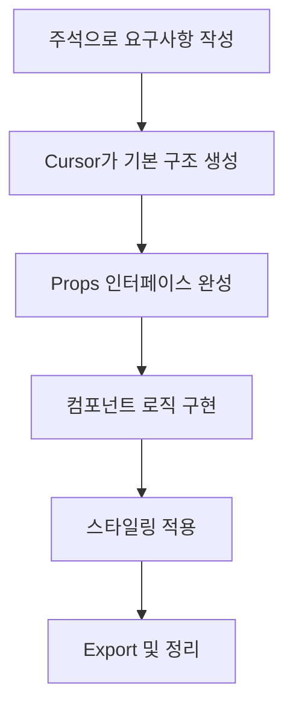
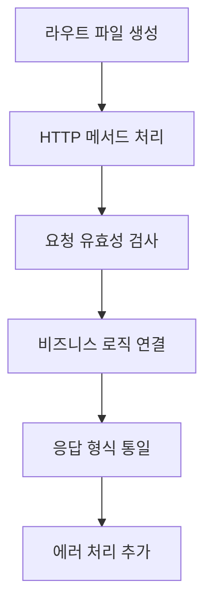
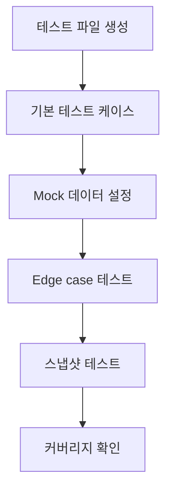

# Cursor AI 전용 가이드

> 빠른 구현과 반복 작업을 위한 전용 가이드

## 🎯 Cursor의 핵심 역할

### 1. 빠른 코드 생성자
- UI 컴포넌트 구현
- 보일러플레이트 코드 작성
- 설정 파일 생성
- 기본적인 CRUD 구현

### 2. 실시간 코딩 어시스턴트
- 타이핑과 동시에 코드 완성
- 즉시 에러 수정
- 패턴 기반 반복 작업
- 리팩토링 자동화

### 3. 로컬 컨텍스트 전문가
- 현재 파일 기반 빠른 수정
- 주변 코드와의 일관성 유지
- 프로젝트 스타일 가이드 준수
- 의존성 자동 추가

## 📝 효과적인 주석 패턴

### 컴포넌트 생성 요청
```javascript
// TODO: Modern React component
// Features: 
// - TypeScript props interface
// - Tailwind CSS styling
// - Responsive design
// - Accessibility support
// Props: title, onClick, variant (primary/secondary), disabled
// Export as default

const Button = () => {
  // Cursor가 여기서 자동 구현
}
```

### API 라우트 생성
```javascript
// TODO: Next.js API route
// Method: POST
// Purpose: User authentication
// Input: email, password
// Output: JWT token or error
// Validation: email format, password strength
// Error handling: 400, 401, 500

export default async function handler(req, res) {
  // Cursor가 자동 구현
}
```

### 스타일링 작업
```css
/* TODO: Modal component styles */
/* Features:
   - Overlay with backdrop blur
   - Centered modal with animation
   - Mobile responsive (full screen on mobile)
   - Dark mode support
   - Smooth open/close transitions
*/

.modal {
  /* Cursor가 자동 구현 */
}
```

## 🔧 자주 사용하는 패턴

### React 컴포넌트 템플릿
```typescript
// Component template request pattern
// Name: [ComponentName]
// Purpose: [구체적인 용도]
// Props: [prop1: type, prop2: type]
// State: [필요한 상태들]
// Styling: Tailwind CSS
// Accessibility: ARIA labels

interface Props {
  // Cursor가 props 인터페이스 생성
}

const ComponentName: React.FC<Props> = () => {
  // Cursor가 컴포넌트 로직 구현
  return (
    // Cursor가 JSX 구현
  );
};

export default ComponentName;
```

### Custom Hook 패턴
```typescript
// Custom hook for [specific purpose]
// Parameters: [param types]
// Returns: [return type]
// Side effects: [useEffect 사용 여부]
// Dependencies: [외부 의존성]

const use[HookName] = (params) => {
  // Cursor가 hook 로직 구현
  return {
    // return 객체
  };
};
```

### API 통신 패턴
```typescript
// API service for [entity name]
// Methods: GET, POST, PUT, DELETE
// Base URL: /api/[entity]
// Error handling: try-catch with typed errors
// Response type: [ResponseType]

class ApiService {
  // Cursor가 CRUD 메서드들 구현
}
```

## 🎨 스타일링 가이드

### Tailwind CSS 패턴
```javascript
// Modern card component with:
// - Clean shadow and rounded corners
// - Hover effects
// - Mobile-first responsive design
// - Dark mode variants

const Card = ({ children }) => (
  <div className="
    // Cursor가 Tailwind 클래스들 자동 완성
  ">
    {children}
  </div>
);
```

### CSS Module 패턴
```css
/* Component: [ComponentName] */
/* Style guide:
   - BEM methodology
   - Mobile-first
   - CSS custom properties for themes
   - Smooth transitions
*/

.component {
  /* Cursor가 스타일 구현 */
}
```

## 📁 파일 구조 패턴

### 새 기능 추가 시
```
// TODO: Create feature structure
// Feature: [FeatureName]
// Structure:
// - components/[Feature]/
//   - index.ts (barrel export)
//   - [Feature].tsx (main component)
//   - [Feature].module.css
//   - [Feature].test.tsx
// - hooks/use[Feature].ts
// - types/[feature].types.ts

src/
  components/
    [Feature]/
      // Cursor가 파일들 생성
```

### 설정 파일 생성
```javascript
// TODO: Configuration file
// Type: [eslint/prettier/tsconfig/etc.]
// Purpose: [구체적인 설정 목적]
// Extends: [기본 설정들]
// Custom rules: [프로젝트 특화 규칙들]

module.exports = {
  // Cursor가 설정 구현
};
```

## 🔄 일반적인 작업 플로우

### 1. 컴포넌트 생성 플로우


### 2. API 구현 플로우


### 3. 테스트 코드 플로우


## 💡 생산성 극대화 팁

### 1. 단계별 구현 요청
```javascript
// Step 1: Basic structure
// Step 2: Add props validation  
// Step 3: Implement event handlers
// Step 4: Add styling
// Step 5: Add accessibility
// Step 6: Add tests

// 각 단계를 주석으로 명시하면 Cursor가 순차적으로 구현
```

### 2. 패턴 재사용
```typescript
// Pattern: [이전에 구현한 패턴명]
// Similar to: [참조할 기존 파일]
// Differences: [차이점들]

// Cursor가 기존 패턴을 기반으로 새로운 코드 생성
```

### 3. 일괄 변경 작업
```javascript
// TODO: Refactor all useState to useReducer
// Files: [파일 목록]
// Pattern: Convert useState(object) to useReducer
// Keep: existing functionality
// Improve: type safety

// Cursor가 여러 파일에 일관된 변경 적용
```

## 🚀 고급 활용법

### 1. 코드 제너레이션
```typescript
// Generate CRUD operations for entity
// Entity: User
// Fields: id, name, email, createdAt, updatedAt
// Include: validation, error handling, types

// Cursor가 완전한 CRUD 시스템 생성
```

### 2. 리팩토링 자동화
```javascript
// Refactor: Extract custom hook
// From: component state logic
// To: reusable hook
// Name: use[FeatureName]
// Dependencies: [관련 의존성들]

// Cursor가 자동으로 hook으로 추출
```

### 3. 테스트 자동 생성
```typescript
// Generate tests for component
// Component: [ComponentName]
// Test types: unit, integration, snapshot
// Mock: API calls, external dependencies
// Coverage: all props, events, edge cases

// Cursor가 종합적인 테스트 슈트 생성
```

## 🔄 Claude와의 협업 지점

### Claude에서 받은 설계 구현
```typescript
// Implementation based on Claude's design:
/* 
[Claude가 제공한 설계 문서 또는 인터페이스]
*/

// TODO: Implement the above design
// Focus: exact interface matching
// Style: project conventions
// Error handling: as specified

// Cursor가 설계를 정확히 구현
```

### 복잡한 로직 적용
```typescript
// Apply Claude's algorithm:
/*
[Claude가 작성한 복잡한 알고리즘]
*/

// TODO: Integrate this logic into React component
// Wrapper: React hooks for state management
// Error boundaries: component level
// Performance: memoization where needed

// Cursor가 React 컴포넌트에 통합
```

## 📊 품질 체크리스트

### 컴포넌트 품질
- [ ] TypeScript 타입 정의 완료
- [ ] Props 유효성 검사
- [ ] 에러 경계 처리
- [ ] 접근성 고려
- [ ] 반응형 디자인 적용
- [ ] 성능 최적화 (memo, callback)

### API 구현 품질
- [ ] 입력 유효성 검사
- [ ] 적절한 HTTP 상태 코드
- [ ] 에러 메시지 표준화
- [ ] 보안 고려사항 적용
- [ ] 응답 형식 통일
- [ ] 로깅 및 모니터링

### 코드 품질
- [ ] 일관된 네이밍 컨벤션
- [ ] 적절한 주석 작성
- [ ] ESLint 규칙 준수
- [ ] Prettier 포맷팅
- [ ] 불필요한 의존성 제거
- [ ] 코드 중복 최소화

## 🎯 자주 하는 실수와 해결책

### 실수 1: 타입 안전성 부족
```typescript
// ❌ 잘못된 방법
const handleClick = (e) => {
  // any 타입 사용
}

// ✅ 올바른 방법
const handleClick = (e: React.MouseEvent<HTMLButtonElement>) => {
  // 명시적 타입 지정
}
```

### 실수 2: 성능 최적화 누락
```typescript
// ❌ 잘못된 방법
const ExpensiveComponent = ({ data }) => {
  const processedData = expensiveCalculation(data); // 매번 재계산
  return <div>{processedData}</div>;
}

// ✅ 올바른 방법
const ExpensiveComponent = ({ data }) => {
  const processedData = useMemo(() => 
    expensiveCalculation(data), [data]
  );
  return <div>{processedData}</div>;
}
```

### 실수 3: 에러 처리 부족
```typescript
// ❌ 잘못된 방법
const fetchData = async () => {
  const response = await api.getData();
  setData(response.data);
}

// ✅ 올바른 방법
const fetchData = async () => {
  try {
    const response = await api.getData();
    setData(response.data);
  } catch (error) {
    console.error('Data fetch failed:', error);
    setError('Failed to load data');
  }
}
```

## 🔧 디버깅 가이드

### 일반적인 에러 해결
```javascript
// TODO: Debug common React errors
// Error types:
// 1. "Cannot read property of undefined"
// 2. "Maximum update depth exceeded"
// 3. "Objects are not valid as React child"
// 4. "Hooks can only be called inside function components"
// Solution pattern: Add null checks, fix dependencies, proper key props

// Cursor가 각 에러 타입별 해결책 제시
```

### 성능 문제 해결
```javascript
// TODO: Performance optimization
// Issues:
// 1. Unnecessary re-renders
// 2. Heavy computations on every render
// 3. Large bundle size
// 4. Memory leaks
// Solutions: memo, useMemo, useCallback, code splitting

// Cursor가 성능 최적화 코드 적용
```

## 📚 레퍼런스 패턴

### 상태 관리 패턴
```typescript
// TODO: State management pattern
// Type: [useState/useReducer/Zustand/Redux]
// Scope: [local/global]
// Data flow: [unidirectional]
// Side effects: [useEffect patterns]

const StateExample = () => {
  // Cursor가 적절한 상태 관리 패턴 구현
}
```

### 폼 처리 패턴
```typescript
// TODO: Form handling pattern
// Validation: [Zod/Yup/custom]
// Submission: [controlled/uncontrolled]
// Error display: [inline/toast/modal]
// Loading states: [submit button/spinner]

const FormExample = () => {
  // Cursor가 완전한 폼 처리 로직 구현
}
```

### 데이터 페칭 패턴
```typescript
// TODO: Data fetching pattern
// Method: [fetch/axios/SWR/React Query]
// Loading states: [skeleton/spinner]
// Error handling: [retry/fallback]
// Caching: [memory/localStorage]

const DataFetchingExample = () => {
  // Cursor가 데이터 페칭 로직 구현
}
```

## 🎉 성공 사례 패턴

### 재사용 가능한 컴포넌트
```typescript
// Success pattern: Reusable Button component
// Features: variants, sizes, states, accessibility
// Usage: consistent across entire app
// Maintenance: single source of truth

interface ButtonProps {
  variant?: 'primary' | 'secondary' | 'danger';
  size?: 'sm' | 'md' | 'lg';
  loading?: boolean;
  disabled?: boolean;
  children: React.ReactNode;
  onClick?: () => void;
}

const Button: React.FC<ButtonProps> = ({
  variant = 'primary',
  size = 'md',
  loading = false,
  disabled = false,
  children,
  onClick
}) => {
  // Cursor가 완전한 버튼 컴포넌트 구현
}
```

### 효율적인 커스텀 훅
```typescript
// Success pattern: Data fetching hook
// Benefits: reusability, separation of concerns
// Features: loading, error, retry, caching

interface UseApiResult<T> {
  data: T | null;
  loading: boolean;
  error: string | null;
  retry: () => void;
}

const useApi = <T>(url: string): UseApiResult<T> => {
  // Cursor가 효율적인 데이터 페칭 훅 구현
}
```

## 🚀 고급 자동화 기능

### 컴포넌트 자동 생성
```bash
# TODO: Component generator script
# Input: component name, props, features
# Output: complete component with tests and styles
# Template: modern React patterns

# Usage: npm run generate:component MyComponent
```

### 스토리북 자동 생성
```typescript
// TODO: Auto-generate Storybook stories
// Component: [ComponentName]
// Variants: all prop combinations
// Controls: interactive prop editing
// Docs: auto-generated from props

const stories = {
  // Cursor가 스토리북 스토리들 자동 생성
}
```

### 테스트 자동 생성
```typescript
// TODO: Comprehensive test suite
// Component: [ComponentName]
// Coverage: props, events, edge cases, accessibility
// Tools: Jest, Testing Library, MSW

describe('ComponentName', () => {
  // Cursor가 완전한 테스트 슈트 생성
})
```

## 📈 지속적 개선

### 코드 품질 자동 체크
```javascript
// TODO: Code quality automation
// Tools: ESLint, Prettier, Husky, lint-staged
// Pre-commit: format, lint, type-check
// CI/CD: tests, build, deploy

// Cursor가 품질 자동화 설정 구현
```

### 성능 모니터링
```typescript
// TODO: Performance monitoring setup
// Metrics: Core Web Vitals, bundle size, render time
// Tools: Web Vitals API, Lighthouse CI
// Alerts: performance regression detection

// Cursor가 성능 모니터링 코드 구현
```

---

## 🤝 마무리: Cursor + Claude 시너지

### 완벽한 협업 예시
```markdown
1. Claude: 복잡한 상태 관리 아키텍처 설계
   ↓
2. Cursor: 설계를 바탕으로 빠른 구현
   ↓  
3. Claude: 성능 최적화 및 코드 리뷰
   ↓
4. Cursor: 최적화 내용을 코드에 적용
   ↓
5. 완성된 고품질 코드 ✨
```

### 역할 분담 체크포인트
- **Claude 영역**: 설계, 최적화, 문제 해결
- **Cursor 영역**: 구현, 스타일링, 반복 작업
- **협업 지점**: 인계 문서, 명확한 가이드라인

---

*Cursor AI의 빠른 구현력으로 개발 속도를 극대화하세요!*
